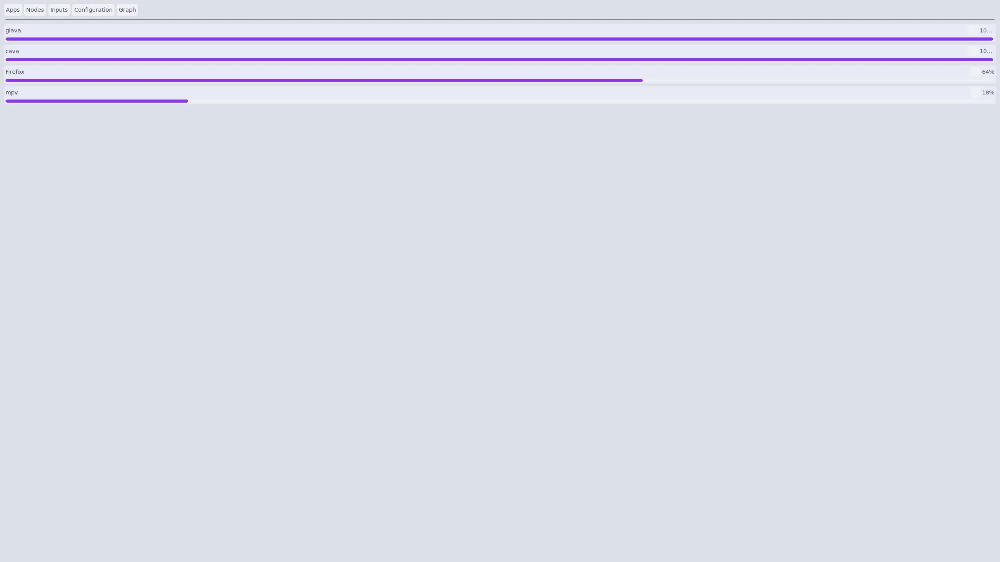

> [!IMPORTANT]
> This repository has been archived in favor of [catppuccin/hyprtoolkit](https://github.com/catppuccin/hyprtoolkit).
> 
> The reasoning was explained in [this comment](https://github.com/catppuccin/catppuccin/issues/2903#issuecomment-4188171588).

 

<h3 align="center">
	 
	
	Catppuccin for <a href="https://github.com/hyprwm/hyprtoolkit"/>hyprtoolkit</a>
	
</h3>

	
	
	

	

## Previews

🌻 Latte

🪴 Frappé

🌺 Macchiato

🌿 Mocha

## Usage

1. See the [themes](./themes) directory for the available flavor and accent combinations
2. Download a theme e.g. `themes/mocha/mauve.conf` into `~/.config/hypr/hyprtoolkit.conf`)

<!--
## 🙋 FAQ
- Q: **Question** \
	A: Answer
--->

## 💝 Thanks to

- [SchweGELBin](https://github.com/SchweGELBin)

&nbsp;

	

	Copyright &copy; 2021-present <a href="https://github.com/catppuccin" target="_blank">Catppuccin Org</a>

	

